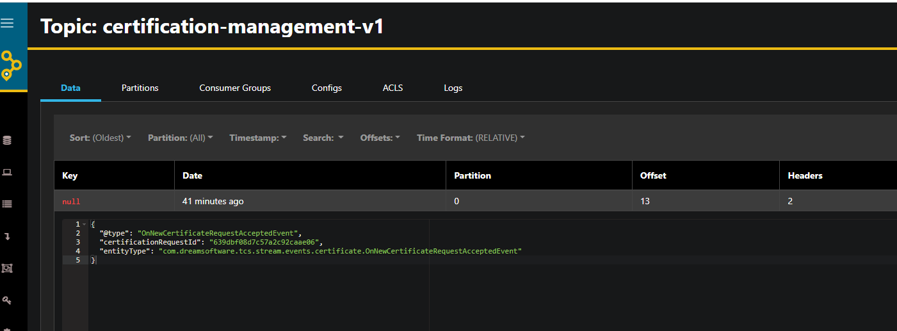
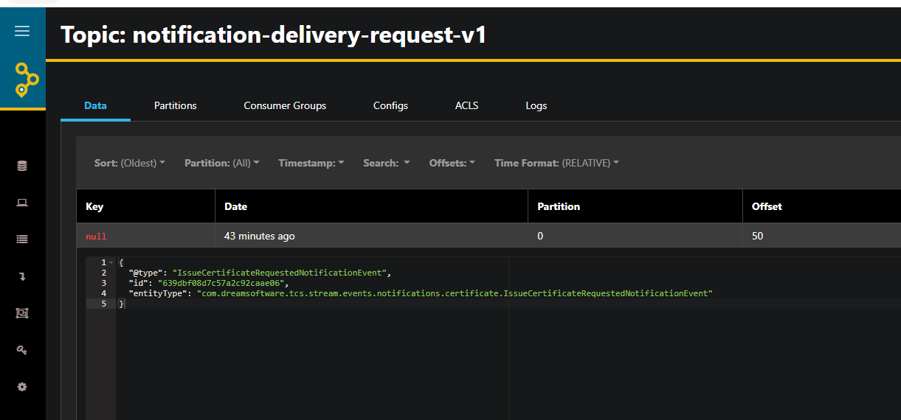

# Trust Certification System - Platform for the management and issuance of digital certificates based on blockchain technology.

  

**Issuance of academic certificates or attendance certificates with Blockchain.**

TCS offers a simple system that eliminates paper traffic and complex operating procedures. Allows the creation of unique certificates, immediately verifiable and unfalsifiable for all types of academic diplomas.

TCS uses Blockchain technology in order to provide inviolability, immutability and easy verification for all your certificates. This platform guarantees students and certificate authorities the possibility of issuein a digital and unforgeable version of their certificates and it is guaranteed that any interested third party can verify their integrity.

A Certification Authority and a Student reach an agreement in order to issue a certificate on the platform, this certificate is generated, signed and stored using cryptographic techniques. After that, the Student can go to any other institution and share their certificate, whose veracity can be verified directly on the platform without having to contact the institution that issued it again.

TCS uses a private IPFS swarm to quickly process and store any number of files on multiple computers simultaneously.

 

  
  
  
  
  
  
  
  
  
  
  
  
  
  
  
  
  

This repository is based on the following projects:

* [Decentralized application designed to guarantee the transparency, traceability, security and truthfulness of the certificates issued by certification authorities.](https://github.com/sergio11/trust_certification_system_ethereum_dapp) 
* [Configuration for TCS microservices platform powered by Spring Cloud Config.](https://github.com/sergio11/trust_certification_system_blockchain_config) 

### TCS-signed, self-generated certificates, securely stored in a private Blockchain.

    
    

## Why Blockchain Technology?

The Blockchain technology is a new technology that appeared in 2008 that allows information to be recorded with guarantees of originality and security never possible before. It is based on a cryptographic system that allows the issuers to be irrefutably identified and that guarantees the immutability of the information.

The application of this technology in this context makes it possible to create a new sort of qualification that is more reliable, transparent, economical and faster. Its ability to guarantee the identity of the certification authority of the certificate represents a paradigm shift that is already beginning to revolutionize the sector.

The implementation of the blockchain network means that there are many copies of the information, all of them necessary and absolutely identical. This makes fraud impossible, and also guarantees the survival of the certificates issued by the certification authority, even though that said Institution disappears. The certificates thus issued are perennial and immutable.

Taking into account all of this, blockchain technology can hasten the end of the paper certification system. Until now, the use of digital certificates had been paralyzed due to the ease with which they could be forged. Blockchain provides organizations with a way to issue digital certificates that are unalterable and valid in perpetuity, since their authenticity can be checked against the system itself. Certificates are transferred as a token on the blockchain and are always available. These advantages over current systems significantly increase the value proposition of digital certificates, possibly leading to their widespread use.

## Advantages of the Trust Certification System.

### Security

Digital certificates cannot be altered or manipulated. They are generated and securely stored on a private blockchain network. Nothing and no one can change the information registered in the Blockchain.

### Integrity

They assure in the face of third parties the authenticity of the identity and the information they contained. The registered information can be verified by third parties, such as companies, selection committees, etc.

### Simplicity

Students or third parties can confirm the authenticity of the certificates immediately, using only the mobile phone.

### Ownership

The student or professional is the sovereign owner of the information and decides with whom to share it. The unequivocal identification of the individual or the products is guaranteed without the possibility of the information being falsified.

## Benefits for students, certification authorities and third parties

### Students

* Comfortable system to share and validate certificates
* Really easy to use, students can request new certificates through a couple steps.

### Certificate Authorities

* Eliminate the possibility of forging certificates.
* Fast certification process.
* Cheaper process, we use our own monetary system based on ERC 20 tokens.
* It stick off as an innovative and avant-garde institution.
* Provides greater value for students.
* Preserves the prestige of the certificaction authority by ensuring the veracity of the certificates.

### Third parties such as companies or other verification institutions.

* Ability to verify candidates' qualifications through a secure, fast and free system for the verifier.
* Safer selection processes that enable economic savings derived from hiring errors.

## Architecture Overview

* **HashiCorp Vault:** Secures, stores and tightly controls access to user wallets.
* **OpenLDAP:** Stores the information of the platform administration users.
* **MongoDB:** Storage of platform information and metadata.
* **MongoDB Express:** It allows us to view and manage the information stored in MongoDB, it is widely used for the purposes of validation and checking the status of the information.
* **Grafana:** It allows us to view real-time metrics of the performance of the platform components, collects information from the Prometheus database.
* **akhq.io:** It allows us to view the information stored in the Kafka topics, it is a very useful tool for the purpose of validating the messages stored in each topic.
* **Kafka:** Central and key element of the architecture, it offers the necessary support to implement a robust and efficient messaging flow.
* **IPFS private swarm:** Distributed and secure storage of digital certificates
* **Private Ethereum network:** Decentralized application designed to guarantee the transparency, traceability, security and truthfulness of the certificates issued by certification authorities. 
* **PayPal**: Gateway that allows the purchase of ETH on the platform.
* **Firebase Cloud Messaging:** Offers a robust and easy-to-implement service for notification delivery to registered devices.
* **Spring Cloud Config Server:** Server-side and client-side support for externalized configuration in a distributed system.
* **Spring Boot Blockchain Monitoring Service:** Recording events from the blockchain network.
* **Spring Eureka Discovery Service:** Eureka instances can be registered and clients can discover the instances using Spring-managed beans.
* **Spring Boot API Gateway:** Microservice that acts as a front for the rest of the clients, offers a wide API and implements the necessary security rules to control access to certain resources.
* **Spring Boot Notification Events Processor:** Microservice responsible for notification delivery.
* **Spring Boot Certificate Events Processor:** Microservice responsible for the generation and registration of certificates.
* **Spring Boot User Events Processor:** Microservice responsible for user management.
* **Spring Boot Course Events Processor:** Microservice responsible for the management of certification courses.

## Several things to be consider.

Below I would like to list several important implementation details:

* For each user registered on the platform (except users with the role of *checker*), a wallet will be generated to be able to operate with smart contracts.
* The secrets of the wallets are stored in the **HashiCorp Vault**, the wallet hash must be provided in order to get the wallet credentials to be able to interact with smart contracts
* Each Certification Authority registered on the platform will be managed by a user account, which will also be able to register additional members (*CA Members*) so that they work on behalf of the entity and can register certification courses, validate certificate requests, etc.
* Each user registered on the platform will receive an initial income in ethers and TCS ERC20 tokens to cover the initial registration costs.
* The members of the certifying entity may register several editions for the same course with a different certificate generation cost.
* Each edition of a certification course may require that the certificate be renewed after a while, it is possible to define the cost of certificate renewal.
* For each certification course it is possible to define an attendance control policy, in such a way that users will only be able to request achievement or attendance certificates when they have reached the minimum percentage of attendance.
* Students and users members of a certification authority may acquire new ERC20 TCS tokens to carry out transactions such as certificate generation, registration of certification courses, for the purchase will be made through a PayPal gateway.
* Any request related to  a certification generation request must be accepted or rejected by a user who is a member of the certification authority to which the certification course belongs. At the time of acceptance, the certification will be generated, stored on the IPFS network, and their information (file signature hash, base58 IPDS id) will be stored at certification smart contract in the blockchain. Users involved in the process will receive notifications about the status of the request.
* Platform administrator users will be authenticated against an OpenLDAP server, they will have sufficient permissions to manage certification authorities and other privileged operations.

## Used technology.

* Spring Cloud Starter Config.
* Spring Cloud Starter Netflix Eureka Client.
* Spring Cloud Stream.
* Spring Cloud Starter Stream Kafka.
* Spring Boot Jasypt.
* Spring Boot Starter Actuator.
* Micrometer Prometheus registry.
* Spring Cloud Config Monitor.
* Spring Vault Core.
* Spring Ldap Core.
* Spring Boot Starter Data MongoDB.
* Spring Boot Starter Data Redis.
* Spring Boot Starter Web.
* Spring Boot Starter Security.
* Spring Boot Starter Mail.
* Spring Boot Starter Thymeleaf.
* Apache POI / PdfBox / Docx4j.
* Web3j.
* PayPal Checkout Sdk.
* Java IPFS Http Client.

## Running Applications as Docker containers.

### Rake Tasks

The available tasks are detailed below (rake --task)

| Task | Description |
| ------ | ------ |
| tcs:check_docker_task | Check Docker and Docker Compose Task |
| tcs:cleaning_environment_task | Cleaning Evironment Task |
| tcs:deploy | Deploys Trust certification System Blockchain and launches all services and daemons needed to properly work |
| tcs:ethereum:check_network_deployment_file | Check Private Ethereum Network Deployment File |
| tcs:ethereum:start | Start Private Ethereum Network |
| tcs:ethereum:stop | Stop Private Ethereum Network |
| tcs:ethereum:undeploy | UnDeploy Private Ethereum Network |
| tcs:ipfs:check_cluster_deployment_file | Check IPFS Cluster Deployment File |
| tcs:ipfs:start | Start IPFS Cluster |
| tcs:ipfs:stop | Stop IPFS Cluster |
| tcs:ipfs:undeploy | UnDeploy IPFS Cluster |
| tcs:login | Authenticating with existing credentials |
| tcs:platform:check_deployment_file | Check Platform Deployment File |
| tcs:platform:compile | Compile Project |
| tcs:platform:init_ldap_backup | Load initial ldap backup |
| tcs:platform:package | Build Docker Images |
| tcs:platform:start | Start Platform |
| tcs:platform:stop | Stop Platform |
| tcs:platform:undeploy | UnDeploy Platform |
| tcs:start | Start Trust certification System Blockchain |
| tcs:status | Status Containers |
| tcs:stop | Stop Containers |
| tcs:undeploy | UnDeploy Trust certification System Blockchain |

To start the platform make sure you have Ruby installed, go to the root directory of the project and run the `rake deploy` task, this task will carry out a series of preliminary checks, discard images and volumes that are no longer necessary and also proceed to download all the images and the initialization of the containers.

### Containers Ports

In this table you can view the ports assigned to each service to access to the Web tools or something else you can use to monitoring the flow.

| Container | Port |
| ------ | ------ |
| Ethereum Lite Explorer | localhost:3001 |
| Ethereum Netstats | localhost:3000 |
| Kafka Topics UI | localhost:8088 |
| MongoDB Express | localhost:8083 |
| Swagger UI API Gateway | localhost:8080 |
| IPFS WebUI | localhost:5001/webui |
| Prometheus WebUI | localhost:8086 |
| Grafana | localhost:8085 (user admin/admin) |

## Some screenshots.

As follow, I include some images that help us to understand how each part of the system works.

Using the Ethereum NetStats dashboard we can visualize the state of the nodes that make up the blockchain network, more specifically we can deduce relevant information such as: the speed of mining, the difficulty established for the generation of blocks, the level of consensus of the network

If it is necessary to obtain specific information for a mined block, we can use the Ethereum Lite Explorer tool to obtain all the relevant information related to the block.

## Please Share & Star the repository to keep me motivated.
  
  

